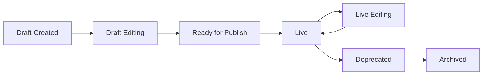

# Games Metadata

## Purpose

This specification defines the comprehensive metadata schema for games in the MLC platform, establishing how games are described, categorized, tagged, and made discoverable. Metadata is the descriptive layer that transforms a collection of game files into an intelligently organized, searchable, and pedagogically aligned learning library.

> **Related Documents**: For the core data model and structures, see [Game Model](game-model.md). For categorization and taxonomies, see [Game Taxonomy](../07-content-architecture/game-taxonomy.md). For CRUD operations and versioning, see [Games CRUD](games-crud.md).

The metadata system enables:
- **Discovery and Search**: Students and teachers find appropriate games through multi-faceted search and filtering
- **Curriculum Alignment**: Games map to learning sequences, educational standards, and skill progressions
- **Pedagogical Organization**: Clear concept relationships, prerequisites, and difficulty progressions guide learning paths
- **System Intelligence**: AI-driven sequence generation and adaptive recommendations rely on rich metadata
- **Content Management**: Editors efficiently organize and maintain a library of 1,000+ games
- **Analytics and Reporting**: Usage patterns and effectiveness analysis depend on consistent metadata tagging
- **Quality Assurance**: Health checks and validation workflows ensure metadata accuracy and completeness

Without comprehensive metadata, the game library becomes an unstructured collection where appropriate content is hard to find, curriculum alignment is manual, and adaptive learning features are impossible.

## Scope

**Included**
- Complete metadata field definitions with validation rules and constraints
- Classification and categorization systems (instruments, modes, levels, categories)
- Concept tagging schema and taxonomy references
- Learning metadata (prerequisites, standards alignment, pedagogical notes)
- Technical metadata (device requirements, MIDI/mic support, timing, language)
- Discovery metadata (keywords, searchability, filtering dimensions)
- Administrative metadata (authorship, versioning, deprecation markers)
- Metadata quality standards and validation workflows
- Metadata lifecycle and governance processes

**Excluded**
- Core game model structures (covered in [Game Model](game-model.md))
- CRUD operation implementations (covered in [Games CRUD](games-crud.md))
- Taxonomy hierarchy definitions (covered in [Game Taxonomy](../07-content-architecture/game-taxonomy.md))
- Asset file specifications (covered in [Games Assets Pipeline](games-assets-pipeline.md))
- Search index implementation (covered in [Search Architecture](../18-architecture/search-architecture.md))

## Data model (if applicable)

### Metadata Field Groups

Game metadata is organized into logical groups representing different aspects of the game. All metadata resides within the Game entity structure defined in [Game Model](game-model.md#core-fields).

#### Core Identification Metadata

Fields that uniquely identify and name the game:

```json
{
  "game_id": "G-01542",
  "game_version": 3,
  "slug": "grand-staff-guide-notes-a",
  "name": "Grand Staff Guide Notes A",
  "short_name": "GS Guide Notes A",
  "display_name": "Grand Staff Guide Notes A",
  "legacy_id": "GAM-0950",
  "status": "live"
}
```

**Field Definitions**:
- `game_id`: Stable canonical identifier, format `G-XXXXX`, never changes after creation
- `game_version`: Integer version number, increments on breaking changes
- `slug`: URL-safe identifier, kebab-case, unique globally, max 100 characters
- `name`: Full official game name, 1-100 characters, must be unique within organization
- `short_name`: Optional abbreviated name for tight UI spaces, max 30 characters
- `display_name`: Formatted name for UI display, may include special characters
- `legacy_id`: Original system game ID (e.g., GAM-0950) for migration tracking
- `status`: Lifecycle state - `draft`, `live`, or `deprecated`

**Validation Rules**:
- `name` required, must be unique, title case recommended
- `slug` required, must be unique, lowercase with hyphens only
- `legacy_id` optional, used for backward compatibility during migration
- `short_name` auto-generated from `name` if not provided, preserves important keywords
- `display_name` defaults to `name` if not provided

#### Classification Metadata

Fields that categorize the game for organization and discovery:

```json
{
  "instrument": "piano",
  "category": "Staff",
  "subcategory": "Grand Staff",
  "mode": "visual",
  "skill_type": "visual",
  "level": "beginner",
  "difficulty": 2,
  "keyboard_mode": "non_keyboard"
}
```

**Field Definitions**:
- `instrument`: Primary instrument focus - `piano`, `general_music`, `choir`, `guitar`, `band`, `orchestra`
- `category`: Primary musical concept category from taxonomy - `Pitch`, `Rhythm`, `Intervals`, `Chords`, `Scales`, `Symbols`, `Playback`, `Keyboard`, etc.
- `subcategory`: Optional refinement within category - e.g., `Treble Staff`, `Bass Staff`, `Grand Staff`
- `mode`: Learning modality - `visual` (notation reading), `aural` (listening), `mixed` (both)
- `skill_type`: Synonym for mode, used in legacy system, kept for compatibility
- `level`: Broad difficulty tier - `pre-primer`, `beginner`, `early_intermediate`, `late_intermediate`, `advanced`, `professional`
- `difficulty`: Numeric ranking within level, 1-10 scale, enables fine-grained ordering
- `keyboard_mode`: Game interaction type - `keyboard` (plays onscreen piano), `non_keyboard` (clicks/touches UI)

**Validation Rules**:
- `instrument` required, must match predefined instrument list
- `category` required, must match taxonomy category codes (see [Game Taxonomy](../07-content-architecture/game-taxonomy.md))
- `subcategory` optional, must be valid for parent category
- `mode` required, must be one of: `visual`, `aural`, `mixed`
- `level` required, must match predefined level codes
- `difficulty` required, integer 1-10, must be consistent with `level` (beginner typically 1-3, advanced typically 7-10)
- `keyboard_mode` required, affects player UI and input handling

#### Concept and Pedagogy Metadata

Fields that define what the game teaches and how it fits into curricula:

```json
{
  "concept_tags": [
    "guide_notes",
    "treble_staff",
    "bass_staff",
    "spatial_relationships",
    "note_reading"
  ],
  "musical_concepts": [
    "STAFF-GRND-LNSP",
    "PITCH-VISL-GUID"
  ],
  "standards": [
    "custom:mlc:L1.staff.guide_notes",
    "menc:2a",
    "menc:6c",
    "nafme:MU:Pr4.2.1"
  ],
  "prerequisites": [
    "STAFF-TREB-TSTF",
    "STAFF-BASS-BSTF"
  ],
  "prerequisite_game_ids": [
    "G-00790",
    "G-00810"
  ],
  "pedagogical_notes": "Teaches spatial relationships between guide notes (Treble G, Middle C, Bass F) and staff lines. Foundation for pattern-based note reading. Students should recognize guide notes before progressing to interval reading.",
  "learning_objectives": [
    "Identify Treble G, Middle C, and Bass F on grand staff",
    "Recognize spatial relationships between guide notes",
    "Build foundation for efficient note reading"
  ],
  "skill_progression_sequence": 2
}
```

**Field Definitions**:
- `concept_tags`: Array of human-readable concept keywords, max 8 tags, each max 50 characters
- `musical_concepts`: Array of taxonomy codes following hierarchical format (see [Game Taxonomy](../07-content-architecture/game-taxonomy.md#classification-codes))
- `standards`: Array of educational standards references using format `provider:code`
- `prerequisites`: Array of taxonomy codes for concepts that should be mastered first
- `prerequisite_game_ids`: Optional array of specific games recommended before this one
- `pedagogical_notes`: Markdown-formatted teaching guidance, 500-2000 characters
- `learning_objectives`: Array of specific measurable outcomes, 1-5 objectives, each 50-200 characters
- `skill_progression_sequence`: Integer indicating position in skill development sequence (1=foundational, higher=advanced)

**Validation Rules**:
- `concept_tags` required, minimum 1 tag, maximum 8 tags, lowercase preferred
- `musical_concepts` optional, must reference valid taxonomy codes
- `standards` optional, format validated against known standard providers
- `prerequisites` optional, must reference valid taxonomy codes
- `prerequisite_game_ids` optional, must reference existing live game IDs
- `pedagogical_notes` optional but strongly recommended for all games
- `learning_objectives` optional, 1-5 objectives recommended
- `skill_progression_sequence` optional, integer 1-99, used for automatic sequencing

#### Technical Requirements Metadata

Fields that specify hardware and software requirements:

```json
{
  "device_profile": "any",
  "midi_capable": true,
  "midi_required": false,
  "mic_capable": false,
  "mic_required": false,
  "keyboard_input": true,
  "timed": false,
  "time_limit_default_seconds": null,
  "language": "en",
  "languages_supported": ["en", "es", "fr"],
  "solfege_text": false,
  "letter_names": true,
  "accessibility_features": [
    "keyboard_navigable",
    "screen_reader_compatible",
    "reduced_motion_mode"
  ],
  "minimum_resolution": "1024x768",
  "recommended_resolution": "1920x1080",
  "browser_requirements": {
    "chromium_min_version": 114,
    "safari_min_version": 17,
    "firefox_min_version": 115
  }
}
```

**Field Definitions**:
- `device_profile`: Aggregated requirement level - `any`, `midi_optional`, `midi_required`, `mic_optional`, `mic_required`
- `midi_capable`: Boolean, true if game can accept MIDI keyboard input
- `midi_required`: Boolean, true if game cannot be played without MIDI keyboard
- `mic_capable`: Boolean, true if game can accept microphone input for pitch/rhythm detection
- `mic_required`: Boolean, true if game cannot be played without microphone
- `keyboard_input`: Boolean, true if game accepts computer keyboard input (not piano keyboard)
- `timed`: Boolean, true if game has countdown timer or time pressure
- `time_limit_default_seconds`: Integer, default time limit for timed games, null if not applicable
- `language`: Primary language code, ISO 639-1 format
- `languages_supported`: Array of supported language codes
- `solfege_text`: Boolean, true if game displays solfege syllables (do-re-mi)
- `letter_names`: Boolean, true if game displays letter note names (C-D-E)
- `accessibility_features`: Array of supported accessibility features
- `minimum_resolution`: Minimum screen resolution required, format WIDTHxHEIGHT
- `recommended_resolution`: Recommended screen resolution for optimal experience
- `browser_requirements`: Object with minimum browser versions

**Validation Rules**:
- `device_profile` required, derived from MIDI/mic requirements if not explicitly set
- `midi_required` cannot be true if `midi_capable` is false
- `mic_required` cannot be true if `mic_capable` is false
- `timed` required boolean
- `time_limit_default_seconds` required if `timed` is true, null otherwise
- `language` required, defaults to "en"
- `languages_supported` must include primary `language`
- `solfege_text` and `letter_names` cannot both be false (must display notes somehow)
- `minimum_resolution` required, validated against standard formats
- `browser_requirements` optional, defaults to platform-wide minimums

#### Discovery and Search Metadata

Fields that enhance findability and filtering:

```json
{
  "keywords": [
    "grand staff",
    "guide notes",
    "note reading",
    "middle c",
    "treble g",
    "bass f"
  ],
  "search_boost": 1.0,
  "featured": false,
  "free_trial": false,
  "challenge_enabled": true,
  "popular": false,
  "new_game": false,
  "hidden_from_all_games": false,
  "teacher_only": false,
  "age_range_min": 7,
  "age_range_max": 18,
  "estimated_duration_minutes": 8
}
```

**Field Definitions**:
- `keywords`: Array of search terms, max 20 keywords, each max 50 characters, supplements concept_tags
- `search_boost`: Float multiplier for search relevance, 0.1-5.0, default 1.0, higher = more prominent
- `featured`: Boolean, true if game should appear in featured/recommended lists
- `free_trial`: Boolean, true if game is playable without subscription (for marketing)
- `challenge_enabled`: Boolean, true if game includes competitive Challenge stage
- `popular`: Boolean, true if game is frequently played (updated automatically or manually)
- `new_game`: Boolean, true if game was published within last 90 days (auto-updated)
- `hidden_from_all_games`: Boolean, true to hide from student All Games browsing (still assignable)
- `teacher_only`: Boolean, true if game is only accessible to teachers (for assessment)
- `age_range_min`: Integer, minimum recommended age in years
- `age_range_max`: Integer, maximum recommended age in years, null if no upper limit
- `estimated_duration_minutes`: Integer, typical time to complete all stages, helps teachers plan

**Validation Rules**:
- `keywords` optional, lowercase recommended, duplicates removed
- `search_boost` optional, float 0.1-5.0, defaults to 1.0
- `featured` defaults to false, requires editor approval to set true
- `free_trial` defaults to false, must align with billing configuration
- `challenge_enabled` auto-computed from stages, can be manually overridden
- `popular` computed from play statistics, manually adjustable
- `new_game` auto-computed from `created_at` timestamp
- `hidden_from_all_games` defaults to false, useful for diagnostic or experimental games
- `teacher_only` defaults to false, restricts student access
- `age_range_min` optional, integer 4-25
- `age_range_max` optional, must be >= age_range_min
- `estimated_duration_minutes` optional, integer 1-60

#### Administrative Metadata

Fields for content management and governance:

```json
{
  "created_at": "2025-01-15T10:00:00Z",
  "created_by": "usr_12345",
  "updated_at": "2025-01-27T14:30:45Z",
  "updated_by": "usr_12345",
  "published_at": "2025-01-20T09:00:00Z",
  "published_by": "usr_12345",
  "deprecated_on": null,
  "deprecated_by": null,
  "replaced_by_game_id": null,
  "deprecation_notes": null,
  "author": "Music Learning Community",
  "copyright_year": 2025,
  "license": "proprietary",
  "internal_notes": "Migrated from legacy GAM-0950. Original target scores adjusted for new scoring system.",
  "quality_reviewed": true,
  "quality_reviewer": "usr_67890",
  "quality_review_date": "2025-01-18T15:00:00Z",
  "content_warnings": []
}
```

**Field Definitions**:
- `created_at`: ISO 8601 timestamp, auto-set on creation
- `created_by`: User ID of creator, auto-set
- `updated_at`: ISO 8601 timestamp, auto-updated on any change
- `updated_by`: User ID of last editor, auto-updated
- `published_at`: ISO 8601 timestamp, set when status changes to live
- `published_by`: User ID who published, set on publish
- `deprecated_on`: ISO 8601 timestamp, set when status changes to deprecated
- `deprecated_by`: User ID who deprecated
- `replaced_by_game_id`: Game ID of replacement, used for migration suggestions
- `deprecation_notes`: Markdown-formatted reason for deprecation, 100-500 characters
- `author`: String, creator or copyright holder name
- `copyright_year`: Integer, year of original creation
- `license`: License type - `proprietary`, `cc-by`, `cc-by-sa`, etc.
- `internal_notes`: Markdown-formatted notes for content editors, not visible to students/teachers
- `quality_reviewed`: Boolean, true if game passed QA review
- `quality_reviewer`: User ID of QA reviewer
- `quality_review_date`: ISO 8601 timestamp of QA review
- `content_warnings`: Array of warning tags - `flashing_lights`, `loud_sounds`, `rapid_motion`, etc.

**Validation Rules**:
- Timestamps auto-managed by system, read-only to users
- User IDs auto-populated from authenticated session
- `replaced_by_game_id` must reference valid game_id, validated on save
- `deprecation_notes` required if status is deprecated
- `author` defaults to organization name
- `copyright_year` defaults to current year on creation
- `license` required, defaults to proprietary
- `internal_notes` optional, max 2000 characters
- `quality_reviewed` defaults to false, requires reviewer permission to set true
- `content_warnings` optional, used for accessibility and safety

### Metadata Relationships

Metadata fields connect to other system entities:

- **Game → Taxonomy**: `category`, `subcategory`, `concept_tags`, `musical_concepts` reference [Game Taxonomy](../07-content-architecture/game-taxonomy.md)
- **Game → Standards**: `standards` array references external educational standards databases
- **Game → Prerequisites**: `prerequisites`, `prerequisite_game_ids` create dependency graph for sequencing
- **Game → Replacement**: `replaced_by_game_id` enables deprecation migration workflows
- **Game → Users**: `created_by`, `updated_by`, `published_by`, `deprecated_by`, `quality_reviewer` link to user accounts
- **Game → Sequences**: Games referenced in sequences use metadata for curriculum alignment
- **Game → Search Index**: Most metadata fields indexed for fast discovery and filtering

## Behavior and rules

### Metadata Validation Rules

Metadata is validated at multiple points in the content lifecycle:

#### On Creation (Draft)

When a new game is created in draft status:
- **Required fields**: `name`, `slug`, `instrument`, `category`, `mode`, `level`, `difficulty`, `keyboard_mode`, `concept_tags` (minimum 1)
- **Auto-generated**: `game_id`, `created_at`, `created_by`, `game_version` (defaults to 1)
- **Optional**: All other metadata fields can be populated later before publish
- **Slug uniqueness**: System checks for duplicate slugs and rejects if found
- **Name uniqueness**: System checks for duplicate names within organization and warns

#### On Update (Draft or Live)

When game metadata is updated:
- **Immutable fields**: `game_id`, `created_at`, `created_by` cannot be changed
- **Version triggers**: Changes to `concept_tags`, `prerequisites`, `difficulty`, or stage configurations increment `game_version`
- **Timestamp updates**: `updated_at` and `updated_by` auto-updated on any change
- **Slug changes**: Allowed but checked for uniqueness, may require URL redirect configuration
- **Deprecation fields**: `deprecated_on`, `deprecated_by`, `replaced_by_game_id`, `deprecation_notes` only editable during deprecation workflow

#### On Publish (Draft → Live)

When publishing a game, full validation enforced:
- **All required fields**: Must be populated and valid
- **Stage completeness**: At least Learn, Play, Quiz stages must exist and be enabled (see [Game Model](game-model.md#stage-set))
- **Target scores**: All enabled stages except Learn must have `target_score` and `pass_threshold` defined
- **Assets**: `html5_bundle_url`, `thumbnail_url` must be reachable and pass smoke tests
- **Concept tags**: Minimum 1 concept tag, maximum 8 tags, all tags must be valid
- **Taxonomy validation**: `category`, `musical_concepts`, `prerequisites` must reference valid taxonomy codes
- **Standards validation**: `standards` array format validated, codes checked against known providers
- **Prerequisite checks**: `prerequisite_game_ids` must reference existing live games
- **Language completeness**: If `languages_supported` includes non-English, all UI text must be translated
- **Accessibility**: If `accessibility_features` claimed, features must be verified in QA

Publish validation failures generate detailed error report showing field-by-field issues. Editor must resolve all errors before publish succeeds.

#### On Deprecation

When deprecating a game:
- **Usage check**: System reports count of sequences, assignments, and active students using game
- **Replacement validation**: If `replaced_by_game_id` provided, must reference valid live game
- **Notes required**: `deprecation_notes` must be populated with clear reason
- **Status enforcement**: Cannot deprecate game already in deprecated status
- **Play history preserved**: Existing scores and history remain accessible but game hidden from new assignments

### Metadata Inheritance and Defaults

Some metadata fields have intelligent defaults or inheritance rules:

**From Parent Category**:
- If `subcategory` not provided, inherits default from `category` mapping
- If `skill_progression_sequence` not provided, estimated from `difficulty` and `category` typical progressions

**From Related Games**:
- If `prerequisite_game_ids` not provided, system suggests prerequisites based on concept overlap and difficulty
- If `estimated_duration_minutes` not provided, estimated from average of similar games in same category/difficulty

**From System Configuration**:
- `browser_requirements` defaults to platform-wide minimum browser versions if not specified
- `minimum_resolution` defaults to platform-wide minimum if not specified
- `license` defaults to organization's default license

**Auto-Computed Fields**:
- `new_game` auto-set to true if `published_at` within last 90 days, auto-updated daily
- `challenge_enabled` auto-computed from stages array, can be manually overridden
- `device_profile` auto-computed from `midi_required` and `mic_required` flags
- `popular` auto-updated based on play statistics (plays_30d > threshold)

### Metadata Quality Standards

High-quality metadata is essential for effective discovery and learning experiences. MLC enforces quality standards:

#### Completeness Tiers

**Tier 1 - Minimum Viable (Draft publishable)**:
- All required fields populated
- At least 1 concept tag
- Slug unique and URL-safe
- Category and mode defined

**Tier 2 - Standard Quality (Recommended for publish)**:
- 3-5 concept tags
- Pedagogical notes provided (500+ characters)
- Learning objectives defined (2-3 objectives)
- Prerequisites identified if applicable
- Standards alignment for at least one framework

**Tier 3 - Exemplary Quality (Featured content)**:
- 5-8 concept tags covering breadth and depth
- Comprehensive pedagogical notes (1000+ characters)
- 3-5 specific learning objectives
- Complete prerequisite mapping
- Alignment to multiple standards frameworks
- Accessibility features documented
- Internal notes for editors
- Quality reviewed and approved

The registry UI displays metadata completeness score (0-100%) and tier badge to guide editors.

#### Consistency Rules

To maintain library coherence:
- **Category alignment**: Concept tags should align with primary category (e.g., Rhythm games should have rhythm-related tags)
- **Difficulty progression**: Games with higher `difficulty` should have more prerequisite requirements
- **Mode consistency**: Visual games should emphasize notation concepts, aural games should emphasize listening concepts
- **Naming conventions**: Game names follow pattern: `[Core Concept] [Variant Number] [Mode Indicator]` (e.g., "Grand Staff Guide Notes 1", "Interval Aces 2 - Aural")
- **Slug patterns**: Slugs follow kebab-case of name, avoid redundant words, max 100 chars

#### Metadata Review Workflow

Before publishing, metadata undergoes review:
1. **Editor self-review**: Creator validates completeness against tier checklist
2. **Peer review**: Another content editor checks for consistency and clarity
3. **QA review**: QA team verifies technical metadata accuracy (device requirements, browser support)
4. **Approval**: SysAdmin or Content Lead approves for publish
5. **Post-publish monitoring**: Analytics track if metadata is effective (are students finding and completing games?)

Metadata issues flagged in post-publish monitoring queue for revision.

### Metadata Lifecycle States

Metadata evolves through distinct phases:



**Draft Created**: Initial metadata populated with required fields only, many optional fields empty  
**Draft Editing**: Iterative metadata enhancement toward publish-ready state  
**Ready for Publish**: All required fields complete, validation passes, awaiting approval  
**Live**: Published metadata visible to teachers and students, indexed for search  
**Live Editing**: Metadata updates on live game, changes versioned, some changes require re-publish  
**Deprecated**: Game hidden from new use, metadata frozen except deprecation fields  
**Archived**: Long-deprecated game moved to archive, metadata read-only, not searchable

Metadata changes in Live state trigger different behaviors:
- **Non-breaking changes** (keywords, pedagogical notes, standards): Update immediately, no version increment
- **Breaking changes** (concept tags, prerequisites, difficulty): Create new version, existing assignments use old version
- **Critical changes** (device requirements, browser requirements): Require re-publish and QA review

## UX requirements (if applicable)

### Metadata Editing Interface

Content editors interact with metadata through structured forms:

#### Create Game Flow

**Step 1: Basic Information**
- Fields: `name`, `slug`, `instrument`, `level`, `difficulty`
- Auto-generate slug from name, allow manual override
- Inline validation for required fields
- Slug uniqueness check on blur

**Step 2: Classification**
- Fields: `category`, `subcategory`, `mode`, `keyboard_mode`
- Category dropdown with hierarchical tree
- Subcategory filtered by selected category
- Mode and keyboard_mode radio buttons

**Step 3: Concepts and Pedagogy**
- Fields: `concept_tags`, `musical_concepts`, `standards`, `prerequisites`
- Concept tags: tag input with autocomplete from existing tags
- Musical concepts: multi-select from taxonomy tree
- Standards: tag input with format validation
- Prerequisites: multi-select from game library with search

**Step 4: Technical Requirements**
- Fields: `midi_capable`, `midi_required`, `mic_capable`, `mic_required`, `timed`, `language`
- Checkboxes and toggles
- Device profile auto-computed and displayed
- Warning if MIDI/mic required (fewer students can play)

**Step 5: Discovery**
- Fields: `keywords`, `featured`, `free_trial`, `age_range`, `estimated_duration_minutes`
- Keywords tag input
- Checkboxes for flags
- Age range dual slider
- Duration input with minutes unit

**Step 6: Pedagogy (Expanded)**
- Fields: `pedagogical_notes`, `learning_objectives`
- Rich text editor for pedagogical notes
- List builder for learning objectives

**Step 7: Review and Save**
- Summary view of all metadata
- Completeness score and tier badge
- Validation error list if any
- "Save as Draft" button

#### Edit Game Flow

- Same form as create, pre-populated with current values
- Version indicator showing current `game_version`
- Change tracking: highlight fields modified since last save
- "Breaking changes" warning if concept tags, prerequisites, or difficulty changed
- "Save Changes" vs "Publish Changes" actions depending on status

#### Bulk Metadata Operations

For managing large game library:
- **Bulk tag addition**: Select multiple games, add concept tag to all
- **Bulk standards mapping**: Select games in category, apply standard to all
- **Bulk keyword generation**: AI-suggest keywords based on existing metadata, apply in batch
- **Bulk prerequisite mapping**: Select sequence of games, auto-link as progressive prerequisites

### Metadata Display in Catalog

Game catalog shows key metadata in compact format:

**List View (Table)**:
- Columns: Name, Category, Level, Difficulty, Status, Challenge Badge, MIDI Badge, Updated
- Sortable by: Name, Category, Difficulty, Updated Date
- Filterable by: Status, Category, Level, Mode, Device Profile, Concept Tags

**Card View (Grid)**:
- Thumbnail image
- Name and level
- Category and difficulty badges
- Concept tags (top 3)
- Challenge/MIDI/Free Trial badges
- Click to view details

**Detail View (Modal)**:
- Hero section: Name, level, difficulty, category
- Tabs:
  - **Overview**: Pedagogical notes, learning objectives, concept tags
  - **Technical**: Device requirements, languages, timing, accessibility
  - **Curriculum**: Standards, prerequisites, skill progression
  - **Discovery**: Keywords, age range, duration, search boost
  - **Admin**: Created/updated/published info, version, quality review status
- Actions: Edit, Duplicate, Deprecate, View in Player

### Metadata in Student/Teacher Views

Students and teachers see simplified, consumer-friendly metadata:

**Student All Games View**:
- Shows: Name, thumbnail, difficulty (as star rating), brief description (first 100 chars of pedagogical notes)
- Filters: Category, Skill Level, "New" flag, "Popular" flag
- No technical metadata exposed

**Teacher Game Selection**:
- Shows: Full name, category, difficulty, concept tags, learning objectives, prerequisites, estimated duration
- Filters: All discovery metadata fields
- Technical details in expandable "Requirements" section
- Standards alignment shown prominently for curriculum mapping

**Assignment Preview**:
- Shows: Learning objectives, estimated duration, prerequisite recommendations, standards addressed
- Alerts: MIDI/mic requirements, age recommendations

### Accessibility

- All metadata editing forms keyboard navigable
- Concept tag input supports keyboard-only tag addition/removal
- Error messages announced to screen readers
- Metadata completeness score has text equivalent
- Color-coded badges have text labels
- Rich text editor has accessible toolbar

## Telemetry

### Metadata Events

Track metadata changes and usage for analytics:

**Metadata Created**  
Event: `game_metadata_created`  
Properties:
```json
{
  "game_id": "G-01542",
  "editor_id": "usr_12345",
  "completeness_score": 45,
  "tier": "minimum_viable",
  "fields_populated": 15,
  "total_fields": 35
}
```
Fires: On initial game creation with draft status

**Metadata Updated**  
Event: `game_metadata_updated`  
Properties:
```json
{
  "game_id": "G-01542",
  "editor_id": "usr_12345",
  "fields_changed": ["concept_tags", "pedagogical_notes"],
  "breaking_changes": false,
  "completeness_before": 45,
  "completeness_after": 60
}
```
Fires: On any metadata field update

**Metadata Published**  
Event: `game_metadata_published`  
Properties:
```json
{
  "game_id": "G-01542",
  "editor_id": "usr_12345",
  "completeness_score": 75,
  "tier": "standard_quality",
  "validation_warnings": 2
}
```
Fires: When game status changes from draft to live

**Metadata Validation Failed**  
Event: `game_metadata_validation_failed`  
Properties:
```json
{
  "game_id": "G-01542",
  "editor_id": "usr_12345",
  "validation_errors": [
    {"field": "concept_tags", "error": "minimum_1_required"},
    {"field": "target_score", "error": "missing_for_quiz_stage"}
  ],
  "attempted_action": "publish"
}
```
Fires: When publish validation fails

**Metadata Search Performed**  
Event: `game_metadata_search`  
Properties:
```json
{
  "user_id": "usr_67890",
  "user_role": "teacher",
  "query": "guide notes staff",
  "filters": {
    "category": "Pitch",
    "level": "beginner",
    "mode": "visual"
  },
  "results_count": 12,
  "top_result_game_id": "G-01542"
}
```
Fires: On game search using metadata

**Metadata-Driven Discovery**  
Event: `game_discovered_via_metadata`  
Properties:
```json
{
  "user_id": "usr_67890",
  "user_role": "teacher",
  "game_id": "G-01542",
  "discovery_method": "filter",
  "metadata_used": ["category", "concept_tags", "difficulty"]
}
```
Fires: When user finds and views game through metadata-based navigation

**Prerequisite Suggested**  
Event: `game_prerequisite_suggested`  
Properties:
```json
{
  "user_id": "usr_67890",
  "user_role": "teacher",
  "game_id": "G-01542",
  "suggested_prerequisite_ids": ["G-00790", "G-00810"],
  "suggestion_source": "metadata"
}
```
Fires: When system suggests prerequisite games based on metadata

### Sampling

- Metadata CRUD events: Never sampled (100% capture for audit)
- Validation events: Never sampled
- Search and discovery events: 10% sampling in production
- Prerequisite suggestion events: 100% capture

## Permissions

### Metadata Read Permissions

**Students**:
- ✅ Read consumer-friendly metadata (name, category, difficulty, description)
- ❌ Cannot read technical metadata (browser requirements, MIDI specs)
- ❌ Cannot read administrative metadata (created_by, internal_notes)

**Teachers**:
- ✅ Read all public metadata (classification, concepts, pedagogy, technical requirements)
- ✅ Read discovery metadata (keywords, estimated duration, age range)
- ❌ Cannot read administrative metadata (internal_notes, quality review status)

**Content Editors**:
- ✅ Read all metadata fields including administrative
- ✅ View full change history
- ✅ Access internal notes

**System Admin**:
- ✅ Full read access to all metadata
- ✅ Access deprecation and replacement metadata
- ✅ View all audit logs

### Metadata Write Permissions

**Students**:
- ❌ No write access

**Teachers**:
- ❌ No write access (can request metadata corrections via feedback form)

**Content Editors**:
- ✅ Create new game metadata
- ✅ Edit all metadata fields except administrative timestamps
- ✅ Add concept tags, keywords, standards
- ❌ Cannot publish (draft status only) without publish permission
- ❌ Cannot deprecate

**Content Editors with Publish Permission**:
- ✅ All Content Editor permissions
- ✅ Publish games (draft → live)
- ✅ Update metadata on live games (with versioning)
- ❌ Cannot deprecate

**System Admin**:
- ✅ All metadata write permissions
- ✅ Publish and unpublish
- ✅ Deprecate and restore
- ✅ Override validation rules (with confirmation)
- ✅ Bulk metadata operations

### Metadata Override Permissions

**Teacher Assignment-Level Overrides**:
- ✅ Can override `target_score` and `pass_threshold` per stage for specific assignment
- ✅ Can override `time_limit_seconds` for specific assignment
- ❌ Cannot override core metadata (concept tags, difficulty, prerequisites)
- Overrides stored in assignment record, do not modify game metadata

**Organization-Level Overrides**:
- System Admin can set organization-wide metadata overrides (e.g., custom difficulty scale, custom category labels)
- Overrides affect display only, do not modify canonical game metadata

## Supporting Documents Referenced

This games metadata specification draws from the following source documents:

- [Game Structure.docx.txt](../00-ORIG-CONTEXT/Game%20Structure.docx.txt) — Original game metadata requirements and categorization
- [Games Loaded.xlsx - Sheet1.csv](../00-ORIG-CONTEXT/Games%20Loaded.xlsx%20-%20Sheet1.csv) — Complete game library with metadata examples
- [Games import master.xlsx - Sheet1.csv](../00-ORIG-CONTEXT/Games%20import%20master.xlsx%20-%20Sheet1.csv) — Import specifications defining metadata fields
- [EXE specs 2012-0913 - Game Screen.csv](../00-ORIG-CONTEXT/exe-specs/EXE%20specs%202012-0913.xlsx%20-%20Game%20Screen.csv) — Game screen metadata display requirements
- [EXE specs 2012-0913 - Category Screen.csv](../00-ORIG-CONTEXT/exe-specs/EXE%20specs%202012-0913.xlsx%20-%20Category%20Screen.csv) — Category and concept parameter system specifications

## Dependencies

### Internal Dependencies

- **[Game Model](game-model.md)**: Metadata fields are part of Game entity schema, validation rules reference model constraints
- **[Game Taxonomy](../07-content-architecture/game-taxonomy.md)**: Concept tags, musical concepts, categories, prerequisites reference taxonomy codes
- **[Games CRUD](games-crud.md)**: CRUD operations enforce metadata validation rules, versioning affects metadata changes
- **[Games Registry Overview](games-registry-overview.md)**: Admin UI displays and edits metadata, uses metadata for filtering and search
- **[Sequence Model](../09-sequences-and-curriculum-tools/sequence-model.md)**: Sequences use game metadata for curriculum alignment and prerequisite checking
- **[Assignment Model](../07-content-architecture/assignment-model.md)**: Assignments reference metadata for display and filtering
- **[Search Architecture](../18-architecture/search-architecture.md)**: Search index populated from metadata fields, faceted search uses metadata
- **[Event Model](../15-analytics-and-reporting/event-model.md)**: Metadata events follow canonical event schema
- **[Permissions Table](../02-roles-and-permissions/permissions-table.md)**: Permission checks reference metadata access rules

### External Dependencies

- **Taxonomy Database**: Stores canonical concept codes, categories, and hierarchies referenced by metadata
- **Standards Database**: Maintains current educational standards frameworks (MENC/NAfME, state standards) referenced by `standards` field
- **Search Engine**: Elasticsearch or equivalent indexes metadata for fast discovery and filtering
- **Translation Service**: Translates metadata fields when `languages_supported` includes multiple languages
- **Asset CDN**: Validates asset URLs in metadata (`thumbnail_url`, `html5_bundle_url`)
- **Analytics Warehouse**: Consumes metadata events for reporting and insights

### Metadata Export Formats

Game metadata can be exported for external use:
- **JSON**: Full metadata export following game model schema
- **CSV**: Simplified metadata export for spreadsheet analysis (flattened structure)
- **XML**: Standards-compliant metadata export (Dublin Core, LOM) for interoperability
- **SCORM manifest**: Metadata mapped to SCORM package metadata for LMS integration

## Open questions

### Metadata Granularity

- **Question**: Should we support per-stage metadata in addition to per-game metadata?  
- **Context**: Currently metadata applies to entire game, but stages have different characteristics (Learn is untimed, Quiz is timed)  
- **Options**:
  - A) Keep game-level metadata only, use stage-level fields within stages array
  - B) Add full metadata schema to each stage (increases complexity)
  - C) Hybrid: Allow subset of metadata fields at stage level (difficulty, duration, requirements)
- **Decision Needed By**: Phase 1 beta

### Auto-Tagging and AI Metadata

- **Question**: Should we implement AI-powered metadata suggestions?  
- **Context**: AI could suggest concept tags, keywords, prerequisites based on game content analysis  
- **Options**:
  - A) Manual metadata only, editors fully control
  - B) AI suggestions optional, editors review and approve
  - C) AI auto-populates draft metadata, editors refine
- **Trade-offs**: AI speeds up metadata creation but may introduce errors or inconsistencies  
- **Decision Needed By**: Phase 2

### Metadata Versioning

- **Question**: Should metadata changes be versioned independently of game versions?  
- **Context**: Currently breaking metadata changes increment game_version, but non-breaking changes don't  
- **Options**:
  - A) Current approach: breaking changes increment version, non-breaking immediate
  - B) Separate metadata_version field, all changes versioned
  - C) Metadata change log only, no versioning
- **Trade-offs**: Full versioning enables rollback but increases complexity  
- **Decision Needed By**: Phase 1 beta

### Metadata Localization

- **Question**: How should we handle metadata localization for international markets?  
- **Context**: `name`, `pedagogical_notes`, `learning_objectives` need translation  
- **Options**:
  - A) Store translations as nested objects within metadata fields
  - B) Separate translation database with game_id + locale key
  - C) Duplicate game records per language
- **Current Assumption**: Option B (separate translation database) most scalable  
- **Decision Needed By**: Phase 3 (internationalization phase)

### Metadata Quality Enforcement

- **Question**: Should we enforce minimum metadata quality tiers before publish?  
- **Context**: Currently "Minimum Viable" tier publishable, but user experience suffers  
- **Options**:
  - A) Enforce "Standard Quality" tier minimum for publish (blocks low-quality metadata)
  - B) Allow "Minimum Viable" but show quality score prominently (transparency)
  - C) Different requirements for featured vs non-featured games
- **Trade-offs**: Stricter enforcement improves quality but slows content pipeline  
- **Decision Needed By**: Phase 1 beta

### User-Generated Metadata

- **Question**: Should teachers be able to contribute metadata (tags, notes, reviews)?  
- **Context**: Teachers have valuable insights into game effectiveness and appropriate usage  
- **Options**:
  - A) No user-generated metadata, editors only
  - B) Teacher reviews and ratings as separate entity, not part of core metadata
  - C) Teacher-contributed tags with approval workflow
- **Trade-offs**: User contributions enrich metadata but require moderation  
- **Decision Needed By**: Phase 2

### Metadata Validation Strictness

- **Question**: Should validation be configurable per organization?  
- **Context**: Some organizations may want stricter standards alignment requirements  
- **Options**:
  - A) Single global validation ruleset for all organizations
  - B) Configurable validation profiles per organization
  - C) Required vs optional field configuration per organization
- **Trade-offs**: Configurability adds flexibility but increases complexity  
- **Decision Needed By**: Phase 2
